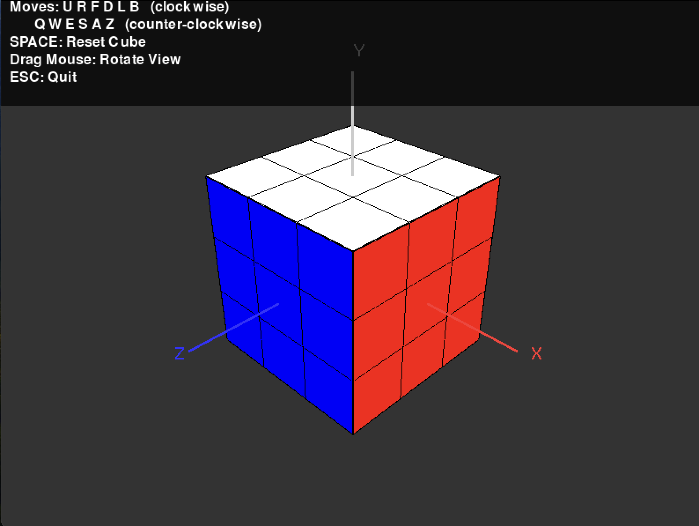

# Rubik's Cube Visualizer

A 3D OpenGL visualizer for a Rubik's Cube. You can interact with the cube and perform standard face rotations using keyboard inputs.



## Installation

1. Clone the repository:

```bash
git clone https://github.com/e-loughlin/rubiks-cube.git
cd rubiks-cube
```

2. Install required Python packages:

```bash
pip install -r requirements.txt
```

## Usage

Run the application:

```bash
python main.py
```

## Controls

- Use the keys to rotate the cube's faces (e.g., `F`, `R`, `U`, etc.)
- Use arrow keys or mouse drag to rotate the entire cube.

## Notes

- Positive **Y-axis** points toward the **white face (U)**
- Positive **X-axis** points toward the **red face (R)**
- Positive **Z-axis** points toward the **blue face (F)**
- Axes and face coordinates are displayed for reference.
